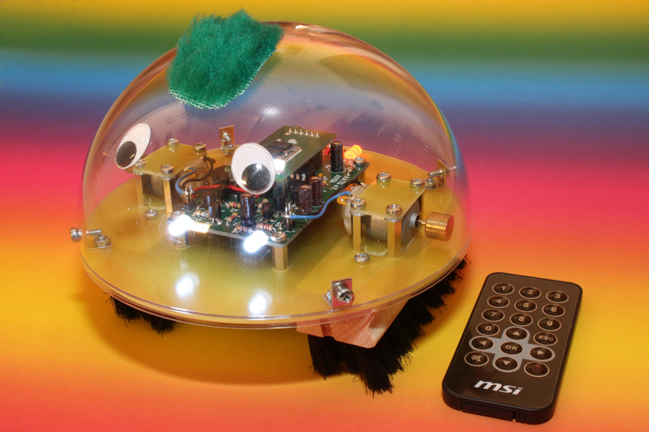
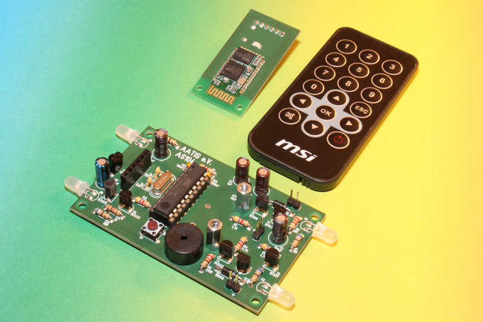

# AATiS Borsti

Borsti ist der ferngesteuerte Bürstenroboter des Arbeitskreis Amateurfunk und Telekommunikation in der Schule e.V. (AATiS) und eignet sich unter anderem ideal für Elektronikeinsteiger sowie technikbezogenen Schulunterricht (MINT).

Er basiert auf einem ähnlichen Prinzip wie es Windell H. Oskay für seinen Bristlebot vorgestellt hat, wurde jedoch auf zwei Bürsten erweitert um den Roboter lenkbar zu machen.

Borsti verfügt über Beleuchtung, Blinker, Blitzlicht und Hupe und kann über die beiliegende Infrarotfernbedienung bedient werden. Optional kann zur Steuerung mittels Android App ein Bluetooth Modul nachgerürstet werden.

Die doppelseitige Platine wird (abgesehen vom Blitzlicht, welches eine SMD LED in der Bauform 1206 ist, und dem optionalen Bluetooth-Modul) ausschließlich mit bedrahteten Bauteilen bestückt. Infrarotfernbedienung, Motoren, Batteriehalter, Schalter, Abstandsbolzen, Schrauben und Unterlegscheiben liegen dem Bausatz bei, die Mechanik muss jedoch selbst angefertigt werden.

Der Bausatz ist unter der Nummer AS104 beim AATiS erhältlich, die Beschreibung ist im Praxisheft 24 erschienen. Ergänzend zum Heftbeitrag sind auf dieser Seite noch einige zusätzliche Informationen zu finden.

## Bezugsquelle für den Bausatz und weitere Informationen

http://www.aatis.de/content/bausatz/AS104_Borsti

http://www.maltepoeggel.de/?site=borsti

## Lizenz

Im September 2015 haben wir uns entschlossen, die Firmware sowie PC Software unter der GNU GPL v3 zu veröffentlichen.

Heftartikel und Leiterplatte unterliegen unverändert dem Copyright des AATiS e.V. und sind nicht Bestandteil dieses Git Repository.
